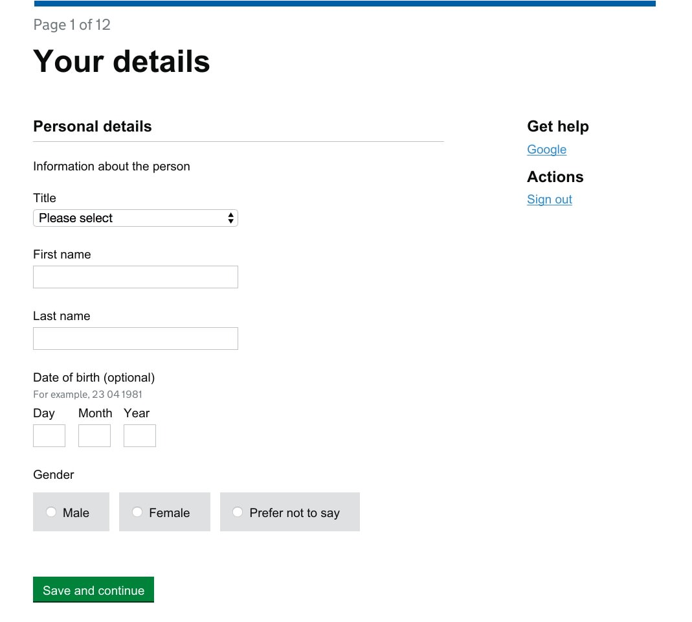
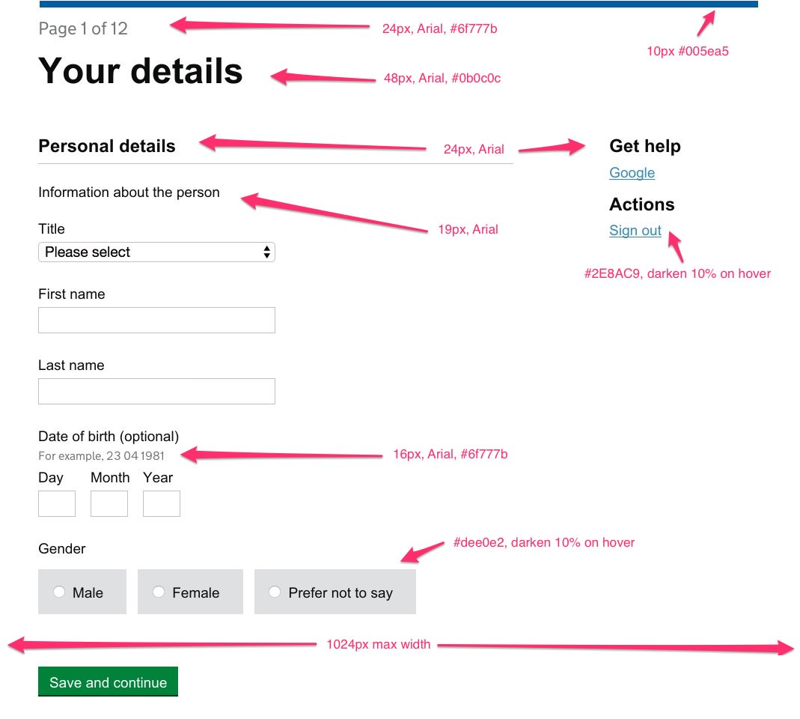

# Frontend Developer Test

## Intro

Thank you for your interest in a developer position at the Ministry of Justice Digital Services team. As part of our recruitment process, we ask that you complete a short code test. Please use any industry standards, best practices, performance tips and code style that you support.

## The Task

1. Markup and style the page layout in `form.png`
2. Validate the form using client side technologies
3. Once you finish coding zip your files up and send the zip file back to the person who instructed you to take the test

## Important notes

- The page should conform to the Government Service Design Manual standards for [desktop browser support](https://www.gov.uk/service-manual/user-centred-design/browsers-and-devices.html#desktop)
- You may use any techniques and technologies you feel are suitable
- If you use any form of pre-processor or task runner please package these files with your code
- Use a HTML5 doctype and use HTML5 capabilities where appropriate
- You may use a JavaScript framework, for example jQuery, but please do not use any third party plugins
- An annotated version of the page with style details has also been included: `form-annotated.png`
- See validation table for rules to use for validation
- Try to limit the amount of time you spend on the test to 2 hours

## Validation rules

| Field             | Rule(s)                |
| ----------------- | ---------------------- |
| Title             | Required               |
| First name        | Required               |
| Last name         | Required               |
| Date of birth     | Optional, Valid date   |
| Gender            | Required               |

## Design

## Annotated Design

